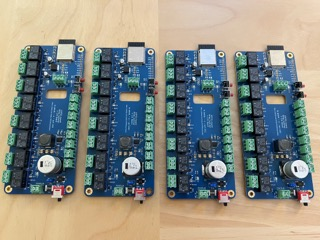
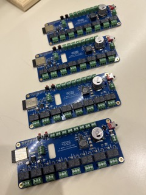
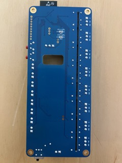

# kbx's 8-channel ESP32-Powered Relay + I/O Board

## What?

A simple ESP32-based board with eight relays for switching various loads
 as well as terminals for eight external/panel-mounted buttons. Also includes
 a terminal strip for connecting one-wire temperature sensor probes. Designed
 to operate with a 24 VAC power supply.

## Why?

A friend asked me to.

## How?

The schematic and PCB were drawn in [KiCAD](https://www.kicad.org); all project files are contained within this repo.

## Look

## Legal stuff and License

The circuit schematics and PCB found here are licensed under the
 [Creative Commons Attribution-ShareAlike 4.0 International License](http://creativecommons.org/licenses/by-sa/4.0/).

_Happy building!_